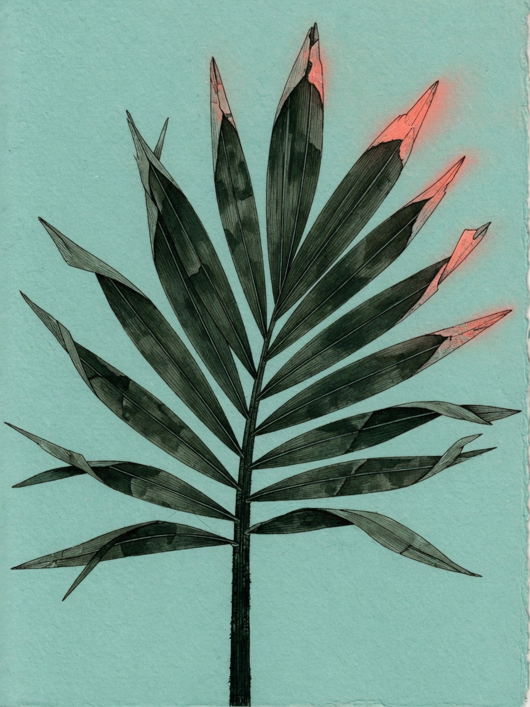

  

# olai

An outliner that lives in files you own. Git records it. A browser edits it. An agent can too.

**[olai.kolu.dev](https://olai.kolu.dev)** — what it is, how to run it, and why.

Docs: [docs/index.md](docs/index.md) · Running: [docs/running.md](docs/running.md) · Developing: [HACKING.md](HACKING.md)
