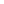

# Kitchen sink — every mark the pipeline claims

This document exists to be LOOKED AT. Everything the one markdown pipeline
claims to draw is below, once each, so a person changing how markdown is set
can serve this corpus (`just serve packages/tests/fixtures/good`), open this
page in a light theme and a dark one, and see the whole surface at a glance
instead of discovering a month later that two heading levels had quietly become
the same size.

It is also what the RHYTHM is checked against. The type and spacing scales are
declared in `packages/web/src/client/markdown/scale.ts`, the stylesheet is
generated from them, and `features/documents.feature` walks every element of
this page — and of a note carrying the same surface — asserting each computed
size, gap, pad and border is a value from those sets. So a drive-by `margin:
6px` goes red here rather than going unnoticed. What no test can judge is
whether the result reads well, which is what the eye below is for.

A first paragraph, to see what a plain run of prose looks like at the top of a
document: the line height, the measure, and how far it sits from the heading
above it. Here is a second sentence so the block is more than one line and the
leading is actually visible.

A second paragraph, immediately after, so paragraph-to-paragraph spacing is
readable as its own decision — **bold**, *italic*, ***both at once***,
~~struck through~~, and `inline code` mixed into ordinary text, plus a
[link to the format doc](https://example.com/format) that has to sit in the
line without shoving it around.

## Heading two — the section level

Prose under a level-two heading. The question this block answers is whether an
`h2` reads as a *new section* or merely as slightly larger text.

### Heading three

Prose under a level-three heading.

#### Heading four

Prose under a level-four heading. This is where the scale gets interesting:
`h4` sits at the body's own size and is told apart by weight alone, and the
two below it have to be told apart by something other than size, because there
is no size left under the text they introduce.

##### Heading five

Prose under a level-five heading.

###### Heading six

Prose under a level-six heading — which is drawn as a label rather than a
heading (muted, letterspaced small caps), because that is what a sixth level
is once the sizes have run out.

---

## Code

Inline `renderMarkdown(source, from)` inside a sentence, then a fenced block
with a language, which is what `rehype-highlight` is here for:

```ts
const pipeline = unified()
  .use(remarkParse)
  .use(remarkGfm)
  .use(remarkRehype, { clobberPrefix: "" })
  .use(rehypeSanitize, { ...defaultSchema, clobberPrefix: "" })
  .use(rehypeHighlight, { detect: false })
  .use(rehypeStringify)

/** A comment, a string, a number, and a keyword walk into a fence. */
export const renderMarkdown = (source: string, from: string): string => {
  const key = `${from}\n${source}`
  const hit = rendered.get(key)
  if (hit !== undefined) return hit
  return render(source, from, key)
}
```

A second fence, in another language, so the palette is judged on more than one
grammar:

```nix
{ pkgs, ... }:
pkgs.mkShell {
  # 7714 is "olai" on a phone keypad
  packages = [ pkgs.bun pkgs.just ];
  shellHook = ''
    echo "olai dev shell" >&2
  '';
}
```

A fence with **no language**, which must not be highlighted at all and must
still be readable:

```
$ olai web ./docs --port 7714
listening on http://127.0.0.1:7714
```

A fence with a very long line in it, to see the horizontal scroll:

```sh
just serve /some/directory/of/outlines --port 7714 --host 127.0.0.1 --no-commit && echo "that line is deliberately far too long to fit inside the column it was written into"
```

## Tables

| field | required | what it means | notes |
|---|---|---|---|
| `id` | yes | unique across the loaded set | survives renames and moves |
| `ord` | yes | fractional index, base62 | an insert, never a renumbering |
| `desc` | no | the note, as markdown | interpreted only at view time |
| `doc` | no | a relative `.md` beside the outline | validated on load |
| `after` | no | edges, acyclic | counting normalized `blocks` |

A table with a long cell, which is the case that decides whether a table may
overflow its column:

| what | where |
|---|---|
| a rule that only exists so the view and the validator cannot disagree about what a relative picture resolves against, spelled once as `docOf` | `packages/format/src/documents.ts` |
| short | `here.ts` |

## Lists

A tight unordered list:

- Doors: **matte**, not gloss.
- Handles: brushed brass.
- Hinges: still undecided.

A loose ordered list, whose items are paragraphs:

1. Validate the whole edited set, over the set the write *would* produce.

2. Write same-directory temp files, under names nothing reads.

3. Rename atomically — all files or none — and then commit.

A deeply nested list, which is what an outline pasted into a note looks like:

- kitchen remodel
  - take out the old counters
  - order the new cabinets
    - walnut — six week lead time
      - quote requested
      - quote received
        - too dear
    - birch — in stock today
  - install the cabinets
    - choose the handles
    - pick the hinges
- garden
  - herb bed

A task list, mixed:

- [x] read the pipeline
- [x] author the fixture
- [ ] screenshot it in both themes
- [ ] wait for feedback
  - [ ] and a nested one, unchecked
  - [x] and a nested one, checked

An ordered list with a nested unordered list and a fence inside it:

1. Open the directory:

   ```sh
   olai web ./docs
   ```

2. Then:
   - reload the tab
   - or don't — the server watches

## Blockquotes

> A quote, one paragraph long, said by somebody who is not the document.
>
> A second paragraph inside the same quote, so quote-internal spacing shows.

A nested quote, which is what a reply to a reply looks like:

> The outer quote says something.
>
> > The inner quote answers it, and carries `inline code` and **bold** so the
> > muted colour can be judged against them.
> >
> > > And a third level, because a thread is a thread.
>
> And back out to the outer quote.

A quote containing a list and a fence:

> Two ways to go:
>
> - **walnut** — six week lead time
> - *birch* — in stock today
>
> ```ts
> const finish = "matte"
> ```

## A picture

A relative picture, resolved beside this document and served from the media
route:



## The long line

A pathologically long line with no spaces in it, which is what a pasted URL or
a hash does to a column: aaaaaaaaaaaaaaaaaaaaaaaaaaaaaaaaaaaaaaaaaaaaaaaaaaaaaaaaaaaaaaaaaaaaaaaaaaaaaaaaaaaaaaaaaaaaaaaaaaaaaaaaaaaaaaaaaaaaaaaaaaaaaaaaaaaaaaaaaaaaaaaaaaaaaaaaaaaaaaaaaa

And the same again as inline code, which is the shape that actually turns up:
`https://example.com/a/very/long/path/that/nobody/would/type/but/every/agent/pastes/anyway?with=a&query=string&and=another&plus=a#fragment-too`

And once more as a link, whose text is the URL:
<https://example.com/a/very/long/path/that/nobody/would/type/but/every/agent/pastes/anyway?with=a&query=string>

## Footnotes

Handles are brushed brass[^brass], and the counters are not[^counters].
A footnote can also be reused[^brass].

[^brass]: Unlacquered, so it ages — which is the point.
[^counters]: Laminate, and the whole reason for the remodel. This note has a
    second line, and `inline code`, to see how a footnote body is set.

## Last thing

A final paragraph, so the bottom margin of the document is visible against the
end of the page.
